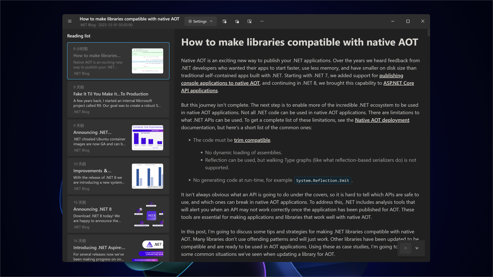

## Overview

[Reader Copilot](https://www.microsoft.com/store/apps/9PFZCKRHW0BC) is a combination of Clean Reader and RSS Track.

Built using the Windows App SDK, it is a native Windows application designed for Windows 11. In addition to architectural updates, it also includes support for PDFs and podcasts.

By incorporating Richasy Assistant as the AI core, features such as machine translation, natural voice reading, and semantic search have been added to create an artificial intelligence experience.

## Supported Platforms

Only available for Windows desktop environments.

Minimum supported version is Windows 10 ver.19041.

## Screenshots

