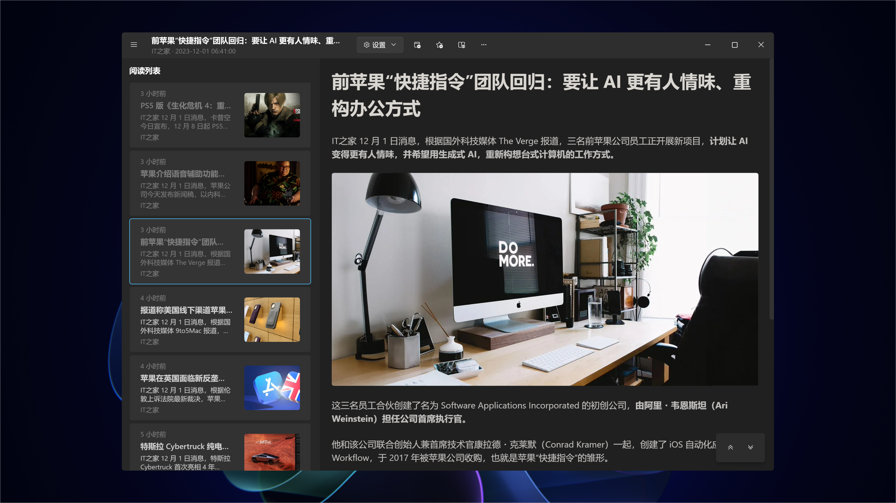

## 概述

[阅读助理](https://www.microsoft.com/store/apps/9PFZCKRHW0BC) 是 [干净阅读](https://www.microsoft.com/store/productid/9MV65L2XFCSK?ocid=pdpshare) 和 [RSS 追踪](https://www.microsoft.com/store/apps/9N85PV1RJD6V) 的集合体。

使用 Windows App SDK 构建应用，是为 Windows 11 设计的 Windows 原生应用。除了架构更新外，还额外添加了 PDF / 播客的支持。

同时将 [小幻助理](https://www.microsoft.com/store/apps/9NB0NB3MLQTM) 作为 AI 核心，构筑了包括 `机器翻译`，`自然语音朗读`，`语义搜索` 等功能的人工智能体验。

## 支持平台

仅限 Windows 桌面环境。

最低支持版本为 Windows 10 ver.19041。

## 截图预览

